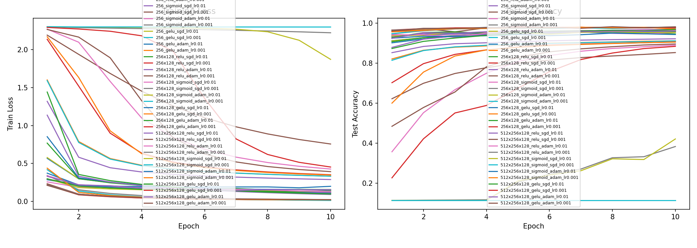
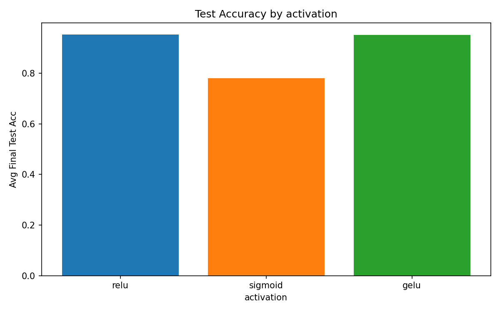
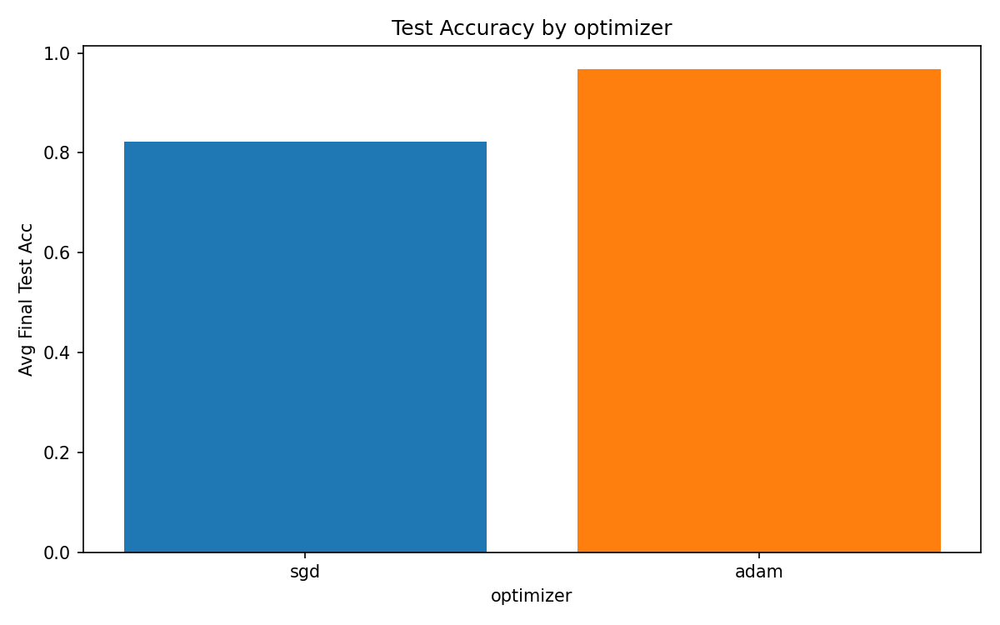

# Lab 1: MLP on MNIST — Results Summary

## Setup

- **Dataset**: MNIST (60k train / 10k test), normalized with mean=0.1307, std=0.3081
- **Epochs**: 10
- **Batch size**: 64
- **Device**: <!-- fill in: cpu / cuda / mps -->

## Experiment Grid

| Factor | Values |
|---|---|
| Hidden dims | `[256]`, `[256, 128]`, `[512, 256, 128]` |
| Activation | ReLU, Sigmoid, GELU |
| Optimizer | SGD, Adam |
| Learning rate | 0.01, 0.001 |

**Total configurations**: 3 x 3 x 2 x 2 = **36 runs**

## Key Findings

### 1. Activation Functions

<!-- TODO: Describe which activation performed best and why. Reference results/compare_activation.png -->

### 2. Optimizers

<!-- TODO: Compare SGD vs Adam. Reference results/compare_optimizer.png -->

### 3. Architecture Depth & Width

<!-- TODO: Discuss how the number of layers and hidden sizes affected accuracy -->

### 4. Learning Rate

<!-- TODO: Discuss the effect of learning rate for each optimizer -->

## Best Configuration

<!-- TODO: Fill in the table below after running experiments -->

| Metric | Value |
|---|---|
| Config | <!-- TODO --> |
| Best test accuracy | <!-- TODO --> |
| Final train loss | <!-- TODO --> |

## Training Curves

## Comparison Figures

## Full Comparison Table

See [results/comparison.csv](results/comparison.csv) for all 36 configurations.

---

## Bonus: Cosine Annealing LR Scheduler with Warm-up and Warm Restarts

<!-- Complete this section if you implemented the bonus scheduler -->

### LR Curve

<!-- Plot the learning rate over training steps. Describe the warm-up, cosine cycles, and decay across restarts. -->

### Comparison with Constant LR

<!-- Does the scheduler improve final test accuracy compared to a constant learning rate? Show numbers. -->

### Effect of Each Component

<!-- How do warm-up, warm restarts, and cross-restart decay each contribute to the result? -->
